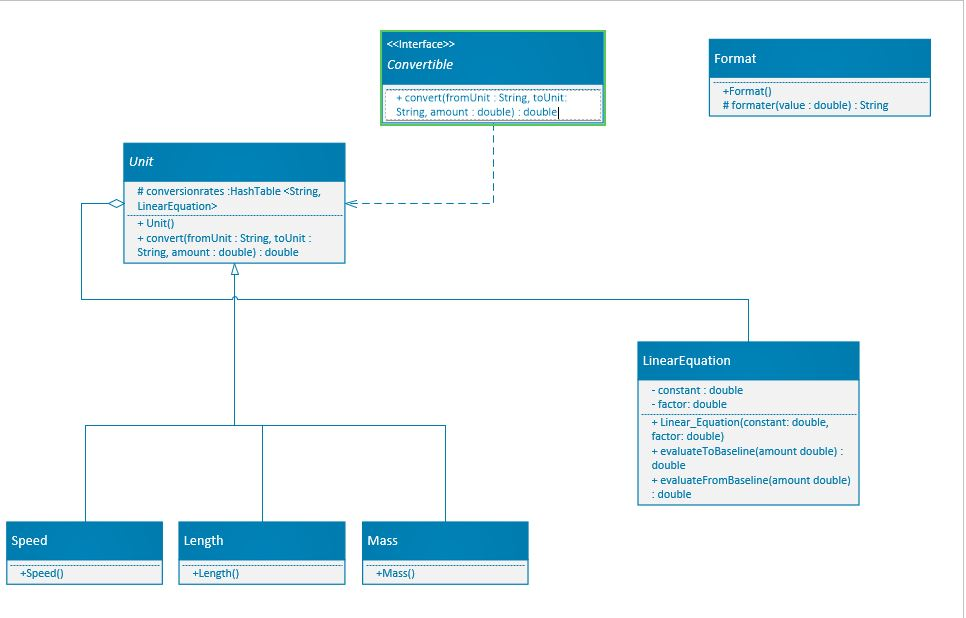
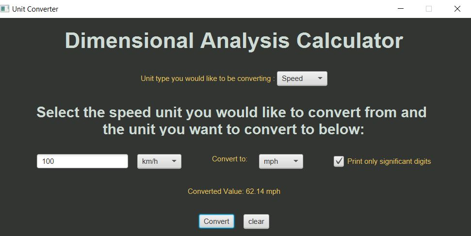
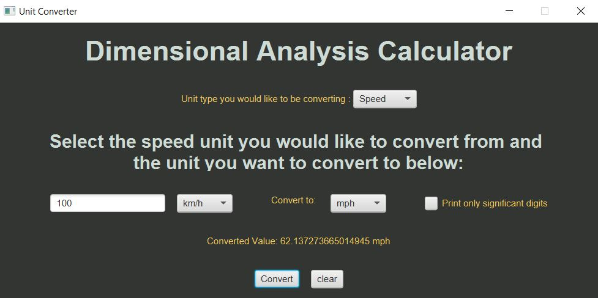

# Dimensional Analysis calculator; The Ultimate Unit Converter

---

### Description:

This unit converter can convert units of mass, length, and speed. By specifying the units you want to convert to and 
from. Within that unit type, you have the ability to convert between all the major units of measurement. JavaFx was 
used to create the application, and BootstrapFx was used to style it. The majority of the difficulties were encountered 
during the GUI integration. One of the biggest difficulties in the development was formatting and printing the 
converted unit amounts. I'd like to integrate new features and versions of the application that expand into more units 
and add new features like the ability to convert from one unit type to another, allowing my target audience to reach 
out to more students and academics.

---

### Design:

The library implements an Interface Convertible that holds the convert method, implementing that interface is the 
abstract class Unit. This is the class that all the unit types extend from and where the conversions are calculated.
It is designed in the way that if anyone wants to add a new unit they would only need to extend from the Unit class and 
in their constructor, they set the HashTable with the keys and the conversion factors. These factors are the conversion 
factors to convert to the standard unit of measurement of that said unit.

This library was specifically designed around the ability to add features with ease and efficiency. The design 
accommodates the possibility to add new features with minimal to no need of code refactoring or changing.

##### UML

---

##### Pictures

---

### Licence

The MIT License (MIT)

